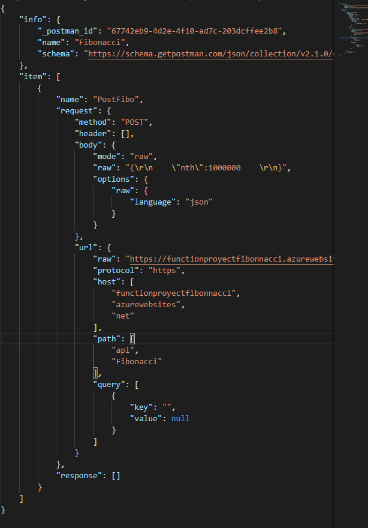
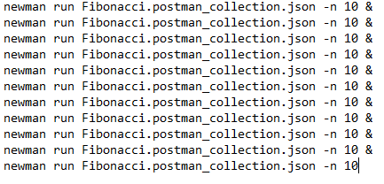
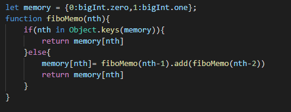
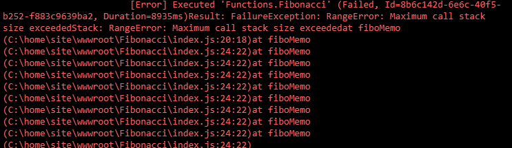
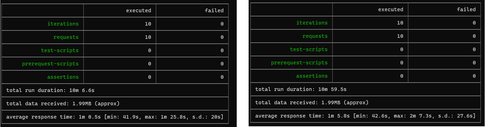
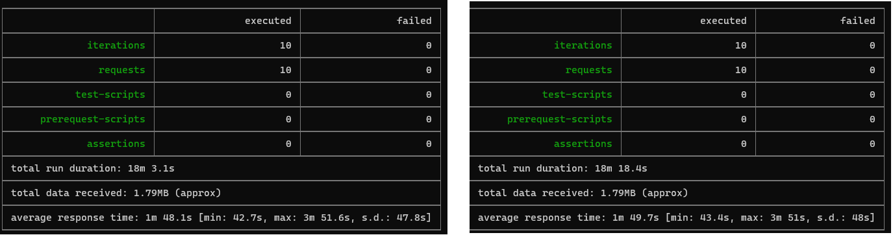
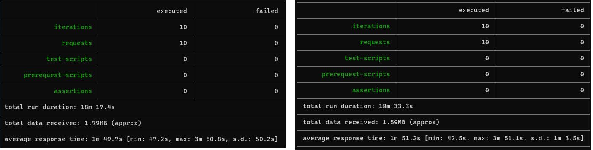
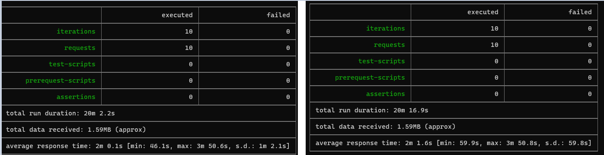
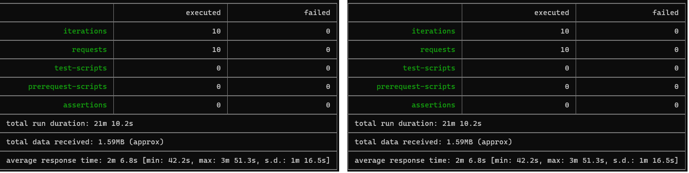
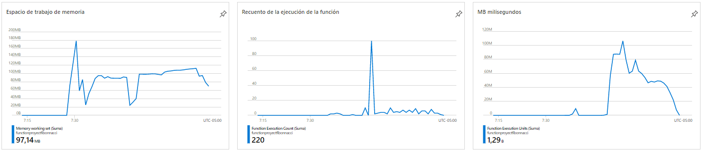

### Escuela Colombiana de Ingeniería
### Arquitecturas de Software - ARSW

## Escalamiento en Azure con Maquinas Virtuales, Sacale Sets y Service Plans
### Integrantes:

> Brayan Alexis Jimenez.\
> Mateo Quintero Acevedo.
### Dependencias
* Cree una cuenta gratuita dentro de Azure. Para hacerlo puede guiarse de esta [documentación](https://azure.microsoft.com/en-us/free/search/?&ef_id=Cj0KCQiA2ITuBRDkARIsAMK9Q7MuvuTqIfK15LWfaM7bLL_QsBbC5XhJJezUbcfx-qAnfPjH568chTMaAkAsEALw_wcB:G:s&OCID=AID2000068_SEM_alOkB9ZE&MarinID=alOkB9ZE_368060503322_%2Bazure_b_c__79187603991_kwd-23159435208&lnkd=Google_Azure_Brand&dclid=CjgKEAiA2ITuBRDchty8lqPlzS4SJAC3x4k1mAxU7XNhWdOSESfffUnMNjLWcAIuikQnj3C4U8xRG_D_BwE). Al hacerlo usted contará con $200 USD para gastar durante 1 mes.

### Parte 0 - Entendiendo el escenario de calidad

Adjunto a este laboratorio usted podrá encontrar una aplicación totalmente desarrollada que tiene como objetivo calcular el enésimo valor de la secuencia de Fibonnaci.

**Escalabilidad**
Cuando un conjunto de usuarios consulta un enésimo número (superior a 1000000) de la secuencia de Fibonacci de forma concurrente y el sistema se encuentra bajo condiciones normales de operación, todas las peticiones deben ser respondidas y el consumo de CPU del sistema no puede superar el 70%.

### Escalabilidad Serverless (Functions)

1. Cree una Function App tal cual como se muestra en las  imagenes.

2. Instale la extensión de **Azure Functions** para Visual Studio Code.

3. Despliegue la Function de Fibonacci a Azure usando Visual Studio Code. La primera vez que lo haga se le va a pedir autenticarse, siga las instrucciones.

4. Dirijase al portal de Azure y pruebe la function.

5. Modifique la coleción de POSTMAN con NEWMAN de tal forma que pueda enviar 10 peticiones concurrentes. Verifique los resultados y presente un informe.
   
   >El comando utilizado para la ejecucion concurrente de las 10 pruebas fue el siguiente:
   
6. Cree una nueva Function que resuleva el problema de Fibonacci pero esta vez utilice un enfoque recursivo con memoization. Pruebe la función varias veces, después no haga nada por al menos 5 minutos. Pruebe la función de nuevo con los valores anteriores. ¿Cuál es el comportamiento?.
   >La implementacion de memoria realizada fue la siguiente, teniendo
   > en cuenta que se mantiene el comportamiento anterior dado por la
   > funcion:
   

   >Cada 5 minutos aproximadamente se borra lo que se encuentra guardado en memoria y
   > se vuelve a recalcular el resultado, ademas despues de un numero
   > aproximadamente mayor 900 el resultado es null debido a dos
   > situaciones el stack en memoria esta lleno o el numero de
   > recursiones maximas fue alcanzado
   > 
**Preguntas**

* ¿Qué es un Azure Function?
> Azure Functions es un servicio en la nube disponible bajo demanda que proporciona toda la infraestructura y los recursos
> necesarios para ejecutar aplicaciones.
> Se puede utilizar Functions para crear API web, responder a cambios en la base de datos, procesar flujos de IoT.
> 
* ¿Qué es serverless?
> Es un modelo de ejecución en el que el proveedor en la nube (AWS, Azure o Google Cloud) es responsable de ejecutar un
> fragmento de código mediante la asignación dinámica de los recursos. Y cobrando solo por la cantidad de recursos utilizados
> para ejecutar el código.
* ¿Qué es el runtime y que implica seleccionarlo al momento de crear el Function App?
>Un runtime environment carga todas las aplicaciones de un programa
> y las ejecuta en una plataforma, en Azure se tiene disponibilidad
> de .NET, Nodejs, Pyhton y Java.
* ¿Por qué es necesario crear un Storage Account de la mano de un Function App?
> Debido a las operaciones de almacenamiento y administracion que
> realizan las Function App.
* ¿Cuáles son los tipos de planes para un Function App?, ¿En qué se diferencias?, mencione ventajas y desventajas de cada uno de ellos.
> **Consumption:** Se factura en
> función del consumo de recursos y las ejecuciones por segundo. El
> precio del plan de consumo incluye una concesión mensual gratuita
> de 1 millón de solicitudes y 400.000 GB-s de consumo de recursos
> por mes y por suscripción en el precio de pago por uso en todas
> las aplicaciones de funciones de esa suscripción. Ofrece un rendimiento mejorado y se factura
> por segundo en función del número de vCPU-s y GB-s que
> consuman sus funciones Premium.
> 
> **Premium plan:** Ofrece las
> mismas funciones y el mismo mecanismo de escalado utilizado en el
> plan de consumo (basado en el número de eventos) sin arranque en
> frío, con un rendimiento mejorado y acceso a VNET. Se factura en función de la vCPU y la memoria
> que consumen sus funciones.
* ¿Por qué la memorization falla o no funciona de forma correcta?
> Debido a los numeros muy grandes que se generan a la hora realizar
> las peticiones, debido al plan que se escogio que fue el
> Consumption, por lo cual el stack de memoria se llena de manera
> rapida y no permite que la memorizacion funcione de manera
> correcta.

* ¿Cómo funciona el sistema de facturación de las Function App?

> Se factura en función del consumo de recursos y las ejecuciones
> por segundo.
* Informe
> Se obtuvo un acierto
> del 100%, adiconalemente los tiempos varian entre 42.2s y 1m 16.5s, esto
> debido al tamaño de la solicitud y al nivel de procesamiento que este
> debe tener, los siguientes son los informes mistrados por newman:
  
  
  
  
  
>Después de ejecutar la coleccion de postman podemos ver que estos son los compartamientos de la cpu y demas indicadores de la aplicación.
  